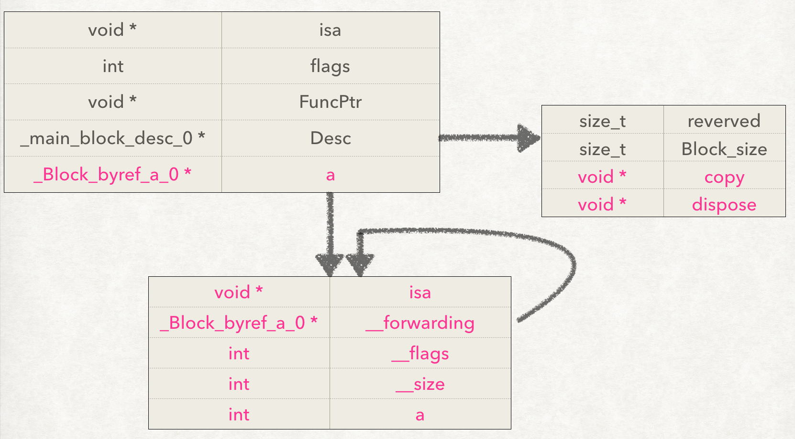
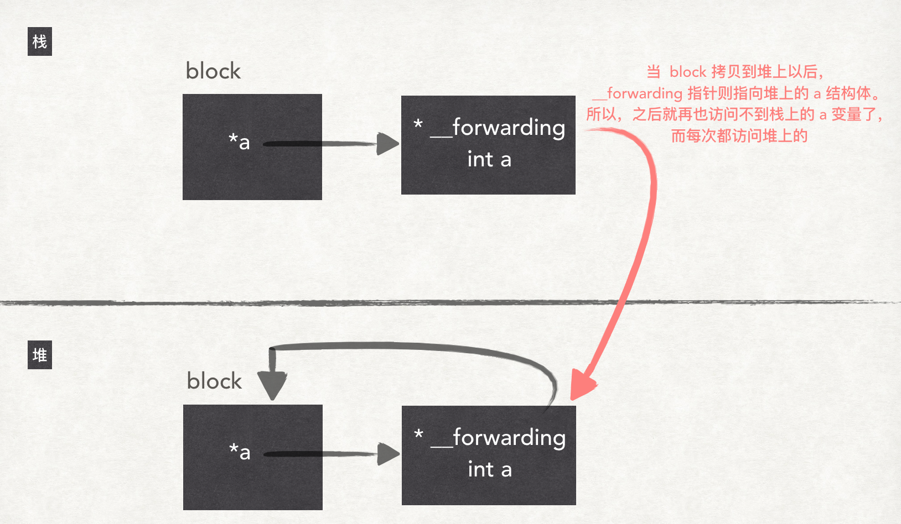

## 一个最基本的 block

Block 编译后，有两个最为重要的部分，impl 结构体 与 desc 结构体指针。我们从最为简单基础的开始：

```objective-c
int main(int argc, const char * argv[]) {
    @autoreleasepool {
        // insert code here...
        
        // 定义一个参数列表与返回值均为空的 block
        dispatch_block_t block = ^{
            // 仅输出一句话
            NSLog(@"123");
        };
        // 调用
        block();
    }
    return 0;
}
```

使用 `clang -rewrite-objc xxx.m ` 命令，编译后（已删除一些影响阅读的字符，用 xxx 代替）：

```cpp
// block 结构体
struct __main_block_impl_0 {
  struct __block_impl impl; // 实现
  struct __main_block_desc_0* Desc; // 描述
  
  // 在定义 block 时，所调用的 block 初始化方法
  __main_block_impl_0(void *fp, struct __main_block_desc_0 *desc, int flags=0) {
    impl.isa = &_NSConcreteStackBlock; // block 的类型(之后会谈到)
    impl.Flags = flags;
    impl.FuncPtr = fp; // block 实现编译后的函数指针
    Desc = desc; // 描述信息
  }
};

// block 的实现
struct __block_impl {
  void *isa; // isa 指针，指向父类的实例。void * 相当于 id 是个实例。
  int Flags; // 
  int Reserved;
  void *FuncPtr; //函数指针 指向block代码块的实现函数
};

// block 的描述
static struct __main_block_desc_0 {
  size_t reserved;
  size_t Block_size; // block 所占的内存大小
} __main_block_desc_0_DATA = { 0, sizeof(struct __main_block_impl_0)}; // block 描述的初始化方法，可以看出这里的大小计算，仅仅是进行了 sizeof


// block 实现编译过后的函数
// 即在 block 初始化方法中，赋值给 impl.FuncPtr 的函数指针
// 参数 cself 是 __main_block_impl_0 类型，即与 block 类型相同，其实这里的参数，本身就是 block 自己
static void __main_block_func_0(struct __main_block_impl_0 *__cself) {
  // 输出
  NSLog((NSString *)&__NSConstantStringImpl__var_xxx_main_c44db5_mi_0);
}


// main 函数
int main(int argc, const char * argv[]) {
    /* @autoreleasepool */ { __AtAutoreleasePool __autoreleasepool; 

	// block 的定义
	// 可以看出，在 block 定义的时候，就调用了 __main_block_impl_0，即 block 的构造方法
	// 传的参数分别为 __main_block_func_0，即 block 对应的编译后的实现函数
	// __main_block_desc_0_DATA，即 block 描述
    dispatch_block_t block = ((void (*)())&__main_block_impl_0((void *)__main_block_func_0, &__main_block_desc_0_DATA));
                    
	// block 的调用
	// 这里也可以看出，block 的调用即是调用了，初始化时拿到的 FuncPtr 函数指针
	// FuncPtr 函数有一个参数，即传入的 block 自身
    ((void (*)(__block_impl *))((__block_impl *)block)->FuncPtr)((__block_impl *)block);
  }
  return 0;
}
```

### block 内存结构

通过编译后得到的 block 结构体，能大致看出，在没有引用外部变量的 block 是这样的：

- `struct __block_impl impl;`
- `struct __main_block_desc_0 *Desc;`

此时的内存结构如下：


### isa 指针

在 block 调用构造方法时，编译器已经自动给 isa 指针赋了初值。我们知道，isa 指针其实很形象，就称作 `is a`，在 OC 中表达了对象是什么类型，类所属哪个元类，其实 block 也是对象，所以它的 isa 指针也是说明它是什么的。如果直接打印 block，则可看到以下三种情况：

- <\__NSStackBlock__: 0x1000010c0>，存储在**栈**上的 block
- <\__NSMallocBlock__: 0x1000010c0>，存储在**堆**上的 block
- <\__NSGlobalBlock__: 0x1000010c0>，存储在**全局区**的 block

但是你会发现，如果直接打印上面我们所写的 block，输出的是 `__NSGlobalBlock__` 类型，而我们看到的编译代码，明明是 stack 的。这是因为 block 的存储区域，与定义在什么位置、是否引用外部变量、是否作为范围值、是被哪种类型的变量所接收等等情况相关，这个会在下一小节谈到。

##  引用外部变量的 block

之前介绍了一个空（并为引用变量）的 block，下面来看一个稍微复杂一点的：

```cpp
int main(int argc, const char * argv[]) {
    @autoreleasepool {
        // insert code here...
        
      	// 定义局部变量 a
        int a = 10;
      	// 定义 block
        dispatch_block_t block = ^{
          	// 输出 a 变量
            NSLog(@"%d", a);
        };
      	// 调用 block
        block();
    }
    return 0;
}
```

在学习 block 的基础知识时，就知道，此时如果在 block 定义之后，去修改 `a` 的值，block 中的输出依然不会改变，我们来看一下为什么。

编译文件：

```cpp
// 下面仅标注了有变化的变量

struct __main_block_impl_0 {
  struct __block_impl impl;
  struct __main_block_desc_0* Desc;
  int a; // 在 block 结构体中，多了一个名为 a 的变量
  
  // block 构造方法也多了一个 _a 参数
  __main_block_impl_0(void *fp, struct __main_block_desc_0 *desc, int _a, int flags=0) : a(_a) {
    impl.isa = &_NSConcreteStackBlock;
    impl.Flags = flags;
    impl.FuncPtr = fp;
    Desc = desc;
  }
};


// 描述依然没有变，size 是直接计算的 __main_block_impl_0
static struct __main_block_desc_0 {
  size_t reserved;
  size_t Block_size;
} __main_block_desc_0_DATA = { 0, sizeof(struct __main_block_impl_0)};

static void __main_block_func_0(struct __main_block_impl_0 *__cself) {
  // 在 block 的实现函数中，访问 block 结构体中的 a 变量，并且编译器在此还说明了是 bound by copy，即值拷贝
  int a = __cself->a; // bound by copy
  NSLog((NSString *)&__NSConstantStringImpl__var_xxx_0, a);
}
```

从编译代码可以看出，在 block 定义时，就传入了 block 内部需要用到的 `a` 变量的**值**，而**并不是引用**，所以即使在 block 定义之后，`a` 变量怎么变，之前 block 所有的 `a` 的瞬时值，是没有变化的。

此时，block 的内存结构为：


多出了捕获的变量 `a` 的存储空间，并且，捕获的变量会接在 Desc 内存后面。

## 被 `__block` 修饰的外部变量

如果没有 `__block` 修饰，除了在 block 定义之后，就不能拿到变量最新的值以外，我们还不能对变量进行重新赋值（如果是堆上的内存，就是改变地址，即 `NSMutableArray` 是可以 `addObject` 的，只是不能 `array = @[]`）。那么，想要解决这两个问题，我们就需要引入 `__block` 修饰符：

```cpp
int main(int argc, const char * argv[]) {
    @autoreleasepool {
        // insert code here...
        
      	// 定义变量 a，并使用 __block 修饰
        __block int a = 10;
        dispatch_block_t block = ^{
          	// 输出 a
            NSLog(@"%d", a); // 输出 100
          	// 在 block 内部对 a 重新赋值
          	a = 50;
        };
      	// 在 block 定义后，对 a 重新赋值
        a = 100;
      	// 调用 block
        block();
      	// 输出 a
        NSLog(@"%d", a); // 输出 50
    }
    return 0;
}
```

这一次，编译后的代码变得很复杂了：

```cpp
// block 结构体
struct __main_block_impl_0 {
  struct __block_impl impl;
  struct __main_block_desc_0* Desc;
  
  // 比起没有被 __block 修饰的变量(编译后，block 中是 int a)，这里 block 却不是简单的拿到 a 地址，即 int *a，而是一个类型为 __Block_byref_a_0 的结构体指针
  __Block_byref_a_0 *a; // by ref 
  
  // 构造方法多出的参数也变成了，__Block_byref_a_0 结构体指针，并且 a 的值是 a->__forwarding，这个 __forwarding 指针的作用，会在之后介绍
  __main_block_impl_0(void *fp, struct __main_block_desc_0 *desc, __Block_byref_a_0 *_a, int flags=0) : a(_a->__forwarding) {
    impl.isa = &_NSConcreteStackBlock;
    impl.Flags = flags;
    impl.FuncPtr = fp;
    Desc = desc;
  }
};


// a 变量的结构体定义
struct __Block_byref_a_0 {
  void *__isa; // isa 指针
__Block_byref_a_0 *__forwarding; // 类型与 a 变量一模一样的 __forwarding 结构体指针
 int __flags;
 int __size;
 int a; // a 真正的值
};


// block 描述
static struct __main_block_desc_0 {
  size_t reserved;
  size_t Block_size;
  
  // 这是比起以前，多出的两个函数指针，一个 copy，一个 dispose
  // 这也是 block 中尤为重要的两个函数
  // copy 负责将 block 复制到堆
  // dispose 负责在 block 释放时，释放 block 所持有的内存
  void (*copy)(struct __main_block_impl_0*, struct __main_block_impl_0*);
  void (*dispose)(struct __main_block_impl_0*);
} __main_block_desc_0_DATA = { 0, sizeof(struct __main_block_impl_0), __main_block_copy_0, __main_block_dispose_0};


// block 实现
static void __main_block_func_0(struct __main_block_impl_0 *__cself) {
  // 访问到 block 中的 a 结构体指针变量
  __Block_byref_a_0 *a = __cself->a; // bound by ref
  
  // 输出
  // 可以看到，这里访问的 a 的值，是通过 __forwarding 指针访问的，包括之后的赋值，也是用的 __forwarding
  NSLog((NSString *)&__NSConstantStringImpl__var_folders_xxx_0, (a->__forwarding->a));
  
  // 将 a 的值重新赋为 50
  (a->__forwarding->a) = 50;
}


// copy 函数
static void __main_block_copy_0(struct __main_block_impl_0*dst, struct __main_block_impl_0*src) {
  // 使用 _Block_object_assign 函数进行拷贝
  _Block_object_assign((void*)&dst->a, (void*)src->a, 8/*BLOCK_FIELD_IS_BYREF*/);
}


// dispose 函数
static void __main_block_dispose_0(struct __main_block_impl_0*src) {
  _Block_object_dispose((void*)src->a, 8/*BLOCK_FIELD_IS_BYREF*/);
}


int main(int argc, const char * argv[]) {
    /* @autoreleasepool */ { __AtAutoreleasePool __autoreleasepool; 
	
		// 初始化 a 的结构体变量
		// 传入的参数分别是:
		// isa: void *0; 
		// __forwarding: &a，即 a 结构体变量的地址
		// __flags: 0
		// __size: sizeof(结构体)
		// a: 10，即 a 的值
        __attribute__((__blocks__(byref))) __Block_byref_a_0 a = {(void*)0,(__Block_byref_a_0 *)&a, 0, sizeof(__Block_byref_a_0), 10};

		// block 定义
        dispatch_block_t block = ((void (*)())&__main_block_impl_0((void *)__main_block_func_0, &__main_block_desc_0_DATA, (__Block_byref_a_0 *)&a, 570425344));

		// 对 a 变量赋值
        (a.__forwarding->a) = 100;

		// block 的调用
        ((void (*)(__block_impl *))((__block_impl *)block)->FuncPtr)((__block_impl *)block);
                            
		// 输出 a
        NSLog((NSString *)&__NSConstantStringImpl__var_folders_xxx_1, (a.__forwarding->a));
    }
    return 0;
}
```

经过了这一坨编译后代码的理解，现在已经脑子已经是一团糨糊了，莫名多出的结构体、`__forwarding` 指针，copy 与 dispose 函数无一不在提高理解的门槛。代码都看得懂，但是就是不知道这样做的目的，下面我们便来将多出的东西，重新整理一次，然后注意理解：

- 现在的 block 内存结构是怎样的？
- 为什么 `a` 被 `__block` 修饰以后，就变成了 `__Block_byref_a_0` 结构体？
- 多出的 `__forwarding` 指针是什么？
- 为什么之后无论是在 block 内部，还是在 block 外部，访问 `a` 都变成了 `a->__forwarding->a` ？
- 既然定义了 copy 与 dispose 函数，为什么没有看到显式调用？如果是隐式调用，那么调用时机是什么时候？
- 多个 block 对 `__block int a = 10;` 进行使用，指针会怎样指向？

### 当前的 block 内存结构



从 main 函数中 `_Block_byref_a_0` 的初始化可以看出，给 `__forwarding` 指针赋的值就是 `(__Block_byref_a_0 *)&a`，所以 `__forwarding` 指针是同样是指向 `a` 结构体变量本身的。

### 为什么在 block 中的变量，超出作用域还能使用

在全局区或者是栈上的 block，我们并不能控制它的释放时机，但是如果 block 在堆中，就可以由我们来控制了。所以，大多数情况下，比如将 block 作为回调方法等时候，block 一般都是在堆上的。

那么，block 是如何拷贝到堆上的呢？这就和 copy 函数有关了。在 ARC 环境下，如果将 block 声明为：

```objective-c
@property (copy) block;
@property (strong) block;
```

在赋值时，其实都会调用 Block_copy() 函数，将栈上的 block 拷贝到堆中，此时，block 中所持有的变量就都在堆中了，我们通过管理 block 的生命周期，就能间接管理到 block 持有的变量的生命周期。

### block 的 copy 时机

那么 block 何时会 copy 到堆上呢？是显式，还是隐式？

#### 显式

- 在作为属性定义时，用 `copy` 和 `strong` 修饰；
- 手动调用 `[block copy]`；

#### 隐式

- 赋值给 `__strong` 修饰的变量时。因为 ARC 下，`__strong` 是缺省值，所以只要不是显式标记了 `__unsafe_unretained` 或 `__weak`，block 均会被拷贝到堆上；
- 作为函数返回值；
- 含有 usingBlock 的 Cocoa 框架中的方法，如枚举器；
- GCD 的 block。

### `__forwarding` 指针存在的意义

在阅读编译代码时可以发现，block 在读写被 `__block` 标记的变量时，均使用 `var->__forwarding->var` 来访问。`var` 是指针能理解，因为它肯定是对临时变量进行地址引用，要不然也不能获得最新的值。但是为什么要在中间加一个 `__forwarding` 呢？而且 `__forwarding` 指针还是指向的自己。

来看一个例子（ARC 下）：

```objective-c
int main(int argc, const char * argv[]) {
    @autoreleasepool {
        // insert code here...
        
        __block int a = 10;
        NSLog(@"1. block 定义之前 a 的地址 : %p", &a);
        dispatch_block_t __unsafe_unretained block = ^{
            a = 100;
            NSLog(@"2. 调用 block 时 a 的地址 : %p", &a);
        };
        NSLog(@"3. block 定义之后 a 的地址 : %p", &a);
        dispatch_block_t heapBlock = block;
        NSLog(@"4. block 拷贝到堆上 a 的地址 : %p", &a);
        block();
    }
    return 0;
}
```

上面的例子中，一共输出了四次 `a` 的地址。其中，1 和 3 的地址是一样的，2 和 4 的地址是一样。

这里我还对 block 特地标记了 `__unsafe_unretained`，防止在定义赋值的时候，就拷贝到堆。而这之后的 `heapBlock` 则是因为被 `__strong` 修饰所以将 block 拷贝到了堆。

在 1、3 输出的时候，`a` 还在栈上，此时的 block 内存为：


而在 block 拷贝到堆上以后， `__forwarding` 指针则指向堆上的 `a` 结构体，所以，内存变成了这样：



这样就保证了栈上和堆上的 block，都能访问到同一个 a 变量，这也是 `__forwarding` 指针的作用。

### block 的存储区域

之前谈到 block 根据存储位置不同，可分为三种，**堆**、**栈**、**全局区**。那么这三种 block 是怎样的呢？

- `__NSStackBlock__`：block 被定义为临时变量，并且引用了外部变量；
- `__NSMallocBlock__`：调用了 copy 函数，被拷贝到堆上的 block；
- `__NSGlobalBlock__`：定义为全局变量，或者临时变量但是没有引用外部变量的 block。

### 多个 block 对 `__block` 变量的引用

在 block 引用使用 `__block` 修饰的外部变量时，编译器去针对这个外部变量生成了结构体，比如我们上面谈到的 `__Block_byref_a_0` 结构体。

之所以这样做，也是为了能在多个 block 引用时，能够给对 `__Block_byref_a_0` 进行复用。所以，当多个 block 引用该变量时，并不会重复生成结构体，而是对该结构体内存进行持有，在 block 销毁，调用 dispose 时，对内存进行释放。

## 循环引用

OC 中的循环引用是一个老生常谈的问题，其中最容易出现循环引用的地方，就是 block。都知道，出现循环引用的原因，是因为两个变量的相互持有，导致谁也无法释放。断开循环引用链，最常见的方式是：

1. 在源头断开：一方不持有另一方；
2. 通过置空断开：在已经对象使用完毕，需要释放的时候，将一方置空。

根据这两种解决方案，block 解决循环引用对应着两种方式：

1. 使用 `__weak` 或者 `__unsafe_unretained` 修饰 block 内部要用到的变量。

```objective-c
__weak typeof(self) weakSelf = self;
self.block = ^{
    NSLog(@"%@", weakSelf);
};
self.block();
```

2. 使用 `__block` 修饰变量，然后在 block 调用完毕后，在 block 内部对变量置空。

```objective-c
__block typeof(self) blockSelf = self;
self.block = ^{
    NSLog(@"%@", blockSelf);
    blockSelf = nil;
};
self.block();
```

使用第二种方式有一个弊端，就是必须要保证 block 会调用，这样才有机会断开循环引用，否则无法解决问题。当然，也有优点，即可以控制另一方的释放时机，保证不调用，就不会释放。

### `__weak` 与 `__strong`

通常我们能看到以下写法：

```objective-c
__weak typeof(self) weakSelf = self;
self.block = ^{
    __strong typeof(self) strongSelf = weakSelf;
    NSLog(@"%@", strongSelf);
};
self.block();
```

`__weak` 的作用我们刚才已经提到了，但是在 block 内部又使用 `__strong` 标记是为什么？这样会造成循环引用吗？我们来看看 block 实现编译过后的代码：

```cpp
static void __Test__init_block_func_0(struct __Test__init_block_impl_0 *__cself) {
    // 这里变成了值拷贝，而不是指针引用
    typeof (self) weakSelf = __cself->weakSelf; // bound by copy
	
    // 虽然是 strong 的，但是是在 block 调用时，才将 self 的值拷贝赋值给临时变量 weakSelf，之后被 strongSelf 引用
    // 根据 ARC 的规则，使用 __strong 修饰的变量，出作用域以后，会插入 release 语句，所以在 block 实现结束后，strongSelf 会释放，并不会造成循环引用
    __attribute__((objc_ownership(strong))) Test * strongSelf =  weakSelf;
    NSLog((NSString *)&__NSConstantStringImpl__var_xxx_0, strongSelf);
}
```

也是因为 ARC 对 `__strong` 修饰的变量，出作用域才插入 release 的机制，我们可以知道，之所以在 block 内部使用 `__strong` 修饰变量，是因为防止在 block 执行过程中，变量被释放的情况。

### 在 block 中调用的方法含有 self，是否会造成循环引用

再看下面这段代码：

```objective-c
- (void)testBlock {
    __weak typeof(self) weakSelf = self;
    self.block = ^{
        __strong typeof(self) strongSelf = weakSelf;
      	// 在 block 实现中，调用了 run 方法，而 run 方法中，又用到了 self
        [strongSelf run];
    };
    self.block();
}

- (void)run {
    NSLog(@"%@", self);
}
```

之前有人问到这个问题，说如果 block 中调用的方法又用到了 self，会造成循环引用吗？想想如果会造成，那岂不是很可怕，好像一直这样写，都没什么问题。那这是为什么呢？

别忘了 OC 是消息机制，发送完消息之后就不管了，所以，并不影响消息的实现。